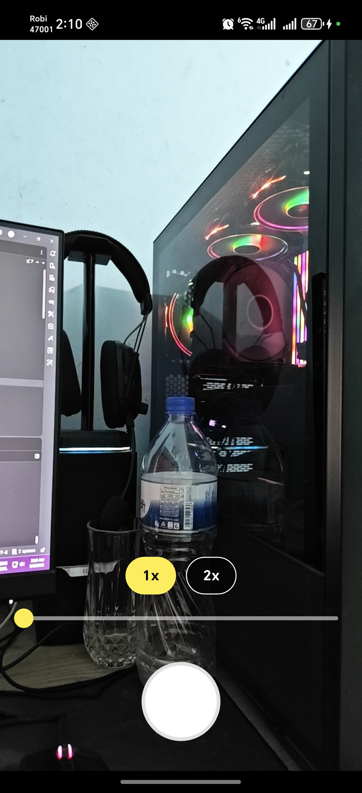
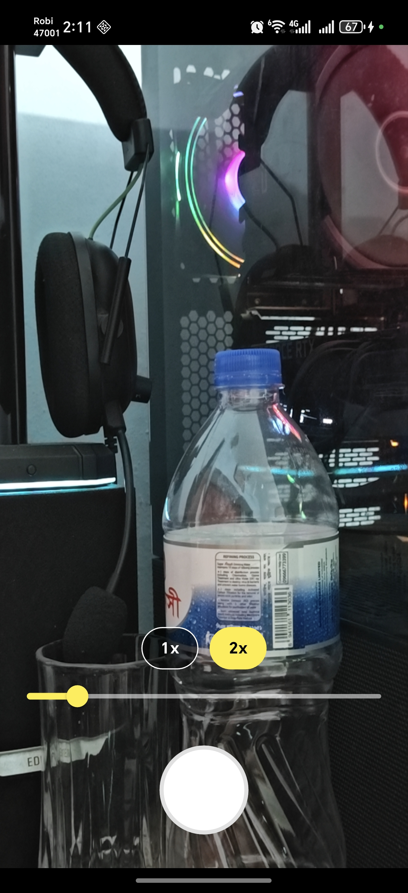
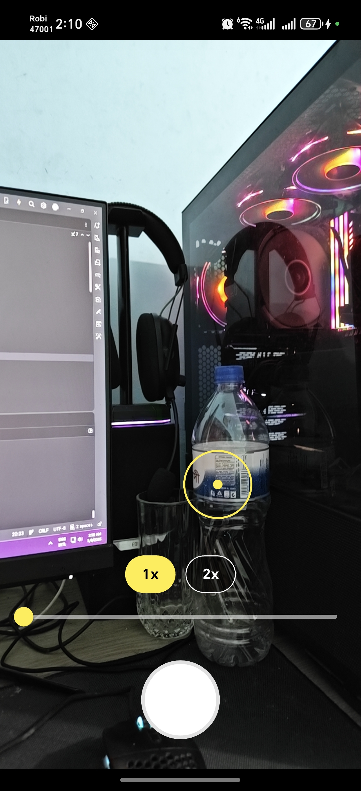
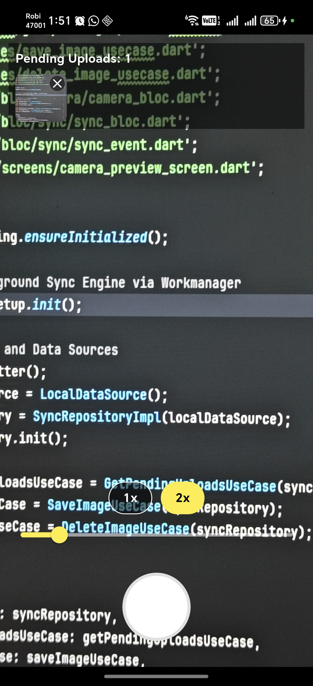

# Advanced Camera & Sync Engine

## Project Description
The Advanced Camera & Sync Engine is a production-ready Flutter application demonstrating strong architectural patterns, resilient background processing, and hardware integration. The app provides a fully custom camera experience with capabilities like pinch-to-zoom, tap-to-focus, and preset zoom levels. Captured images are seamlessly handled via an offline-first batch queue powered by Hive and uploaded resiliently via a simulated background worker using Workmanager.

## Technical Stack
- **Flutter**: UI and cross-platform framework
- **BLoC**: State Management (flutter_bloc)
- **Hive**: Local NoSQL Database for offline persistence
- **Camera Plugin**: Direct hardware integration for custom preview and capture
- **Workmanager**: Background task scheduling for robust offline-first synchronization
- **Connectivity Plus**: Network state monitoring for upload retries

## Project Structure / Architecture
This project adheres to **Clean Architecture** principles to separate concerns, improve testability, and decouple the UI from business logic.

- **`lib/core/`**: Shared constants, themes, and utilities like Workmanager dispatchers.
- **`lib/data/`**: Data origins such as `LocalDataSource` (Hive implementations) and `repositories/sync_repository_impl.dart`.
- **`lib/domain/`**: The core logic layer. Contains `entities` (like `CapturedImage`), abstract interfaces for `repositories`, and `usecases` containing isolated business rules (e.g., `SaveImageUseCase`, `DeleteImageUseCase`).
- **`lib/presentation/`**: Contains the BLoC state managers (`CameraBloc`, `SyncBloc`), interactive UI `screens/` and reusable `widgets/`.

### Major Components
- **`CameraBloc`**: Manages the intricate state of the camera. It safely parses and delegates commands down to the device hardware (`CameraController`), capturing exceptions natively and securely emitting user-friendly states to the UI.
- **`CameraPreviewScreen`**: The custom camera interface combining specialized widgets like `FocusIndicator` and `ZoomControls`.
- **`SyncWorker`**: A Workmanager background isolate bridging `connectivity_plus` and the `SyncRepository`. It queues uploads and automatically defers execution if network access drops.
- **`Hive queue storage`**: Locally buffers `CapturedImage` models in real-time, instantly making the file available in the "Pending Uploads" list.

## Generative AI Usage
During development, generative AI tools were utilized to orchestrate and accelerate complex boilerplate structures. Examples include:
- Generating the BLoC event-state architectures for both the camera and background sync systems.
- Resolving compile errors related to package breaking changes and lifecycle handling.
- Implementing the resilient Workmanager sync engine and Hive entity serialization.
- Refining mathematical boundaries for the pinch-to-zoom limits and tap-to-focus normalized coordinate calculations.

## How to Run

1. Clone the repository: `git clone <repository_url>`
2. Fetch dependencies: 
   ```bash
   flutter pub get
   ```
3. Connect an Android device with developer options active.
4. Run the project:
   ```bash
   flutter run
   ```

## Release Build Instructions
To build a highly optimized, production-ready Android APK, execute:
```bash
flutter build apk --release
```
The generated standalone APK will be located at:
`build/app/outputs/flutter-apk/app-release.apk`

## Screenshots

### Camera Preview Screen


### Zoom Controls


### Tap to Focus


### Pending Uploads

